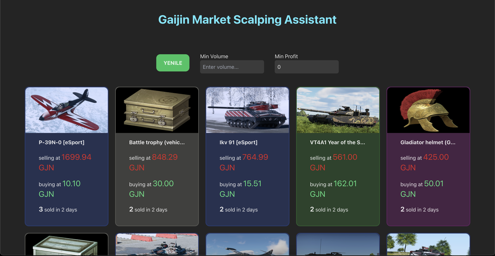

# Gaijin Marketplace Trading Assistant

A Node-based full-stack trading assistant that helps you find the best possible trades in Gaijin Marketplace and <b>makes sure your trades stay profitable</b> using the auto-inspection feature.

## Technologies Used

-Node.js
-Express
-React
-Axios
-Tailwind

## How Does it Work?

### Getting and displaying the data:

The backend utilizes Axios to fetch data from Gaijin servers imitating an actual user by using a JWT generated through signing in to the Marketplace.

Since there are rate limitations from Gaijin's side, as well as the fact that they wouldn't send detailed data in a whole, the application runs a /detail query on each item received, to access all of the information such as trade volume, listing prices and others.

The trading assistant's React-based user interface displays each item listed on Gaijin's War Thunder marketplace by fetching it from its own backend.

### Filtering

The frontend UI currently has two inputs, for trade volume and the possible profit respectively, the user can utilize these inputs to either maximize trading speed by playing for low-profit but consecutive and rapid trades OR can play the long game by investing in materials that have a low trading volume but can yield larger profits.

## Automated Competitive Bidding Guard 
The marketplace is volatile; manual order adjustment is often too slow to compete with high-frequency fluctuations. The Auto-Bidding Guard feature solves this by:

- **Following Orders:** The assistant follows all of the user's orders and checks if any of them has been undercut.

- **Auto Re-listing:** If so, the assistant then cancels those orders and makes sure the user has the most relevant orders by listing them again with a higher/lower price (e.g -$0.01 or +$0.01).